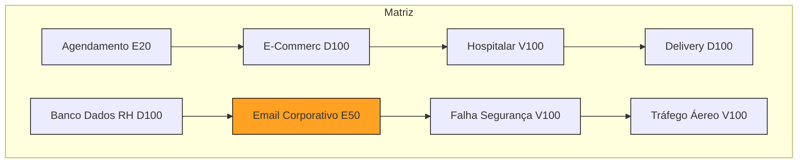

# Atv-Gr-fico-Crystal
# Exercícios
Leia os cenários abaixo e, para cada um:
1.Classifique a criticidade (C – Conforto, D – Dinheiro, E – Essencial, V – Vida).
2.Defina a intensidade do impacto (8 – baixo, 20 – moderado, 50 – alto, 100 – crítico).
3. Crie uma matriz no git hub para demonstrar a criação da matriz
1.O sistema de agendamento interno de uma empresa apresenta lentidão, mas ainda funciona.
2.A plataforma de e-commerce ficou fora do ar durante a Black Friday.
3.Um sistema hospitalar de prescrição de medicamentos apresentou falha e não mostra dosagens corretas.
4.O aplicativo de delivery não atualiza o status dos pedidos em tempo real.
5.Um banco de dados de RH perdeu registros de ponto eletrônico de 1 semana.
6.O servidor de e-mail corporativo caiu por 2 horas em uma empresa multinacional.
7.Uma falha de segurança expôs dados sensíveis de clientes em uma fintech.
8.Um sistema de controle de tráfego aéreo apresentou falhas intermitentes.

